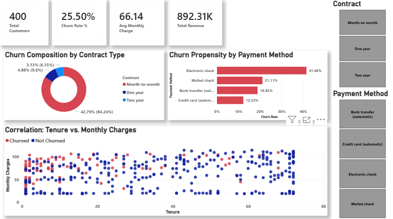

# 📊 Telco Customer Churn Analysis

## 📌 Project Overview
This project analyzes customer churn behavior using the **Telco Customer Churn dataset**.  
The objective is to identify key factors influencing customer attrition and to develop data-driven insights that help improve customer retention strategies.

The project follows an end-to-end analytics workflow using **SQL for data preparation**, **Python for analysis and modeling**, and **Power BI for visualization**.

---

## 🎯 Project Objectives
- Understand customer churn patterns  
- Identify key factors driving customer attrition  
- Build predictive insights to support business decisions  
- Present findings through interactive dashboards  

---

## 🗂 Dataset
The dataset includes customer demographic information, service usage, and billing details such as:
- Contract type  
- Tenure  
- Monthly and total charges  
- Payment method  
- Churn indicator  

---

## 🧹 Data Preparation (SQL)
- Removed missing and invalid records  
- Converted data types for accurate analysis  
- Engineered features such as:
  - Churn flag  
  - Tenure-related metrics  
- Prepared a clean, analysis-ready dataset  

---

## 🔍 Exploratory Data Analysis (Python)
Using **Pandas**, **Matplotlib**, and **Seaborn**, the following analyses were performed:
- Distribution of churned vs retained customers  
- Churn patterns by contract type and payment method  
- Relationship between monthly charges and churn  
- Identification of key behavioral trends  

---

## 🤖 Modeling
- Built a **Logistic Regression** model to predict customer churn  
- Evaluated model performance using:
  - Confusion Matrix  
  - Accuracy  
  - Precision & Recall  

---

## 📊 Power BI Dashboard
An interactive dashboard was created to visualize:
- Overall churn rate  
- Churn by contract type  
- Churn by payment method  
- Monthly charges vs churn behavior  

The dashboard enables dynamic filtering and clear business insights.

---

## 📊 Visualization

This interactive Power BI dashboard provides a comprehensive view of customer churn behavior using insights derived from the cleaned and modeled dataset. It helps identify key churn drivers and supports data-driven decision-making.

🔍 **Dashboard Overview**

The dashboard highlights:
- Overall churn rate and total customer base
- Churn distribution by contract type
- Churn propensity by payment method
- Relationship between tenure and monthly charges
- Key KPIs such as total customers, churn rate, average monthly charges, and total revenue



📌 **Key Visuals Included**

- **Churn Composition by Contract Type**
Shows churn distribution across Month-to-Month, One-year, and Two-year contracts.

- **Churn Propensity by Payment Method**
Identifies higher churn among customers using specific payment methods.

- **Tenure vs Monthly Charges Scatter Plot**
Visualizes churn behavior across different tenure lengths and billing patterns.

- **KPI Cards**
  - Total Customers
  - Churn Rate (%)
  - Average Monthly Charges
  - Total Revenue

---

## 🧰 Tools & Technologies
- **SQL** – Data cleaning & transformation  
- **Python** – Analysis & modeling  
- **Power BI** – Visualization & dashboards  
- **Pandas, NumPy, Seaborn, Scikit-learn**

---

## 🧠 Business Insights
- Month-to-month customers show the highest churn rate  
- Higher monthly charges increase churn likelihood  
- Long-term contracts significantly reduce churn  
- Payment method influences customer retention  

---

## 💼 Business Value

This project delivers actionable insights that help organizations understand and reduce customer churn. By combining SQL-based data preparation, Python-driven analytics, and Power BI visualization, the analysis enables data-backed decision-making across teams.

Key business benefits include:
- Early churn detection by identifying high-risk customer segments
- Improved customer retention strategies through contract and payment behavior analysis
- Revenue optimization by understanding how pricing and tenure impact churn
- Data-driven decision support for marketing, customer success, and leadership teams
- Scalable analytics framework that can be extended to other business domains
This solution helps organizations move from reactive churn handling to proactive customer retention planning.

---

## ✅ Conclusion

This project demonstrates a complete end-to-end analytics workflow — from raw data cleaning and feature engineering in SQL to advanced analysis and visualization using Python and Power BI.

By integrating data preparation, exploratory analysis, predictive modeling, and business intelligence dashboards, the project showcases strong analytical thinking and practical problem-solving skills. It highlights how data can be transformed into meaningful insights that drive strategic decisions and improve customer retention.

This end-to-end approach makes the project highly relevant for real-world business analytics and data analyst roles.

---

## 👤 Author
**Muhammed Nafih**  
Data Analyst |Python | SQL | Power BI | Data Visualization

🔗 **LinkedIn:**  
https://www.linkedin.com/in/nafihhmohd/

---

## ▶️ How to Run
1. Clone the repository  
   ```bash
   git clone https://github.com/nafihhmohd/churn-analysis-sql-python-powerbi.git
